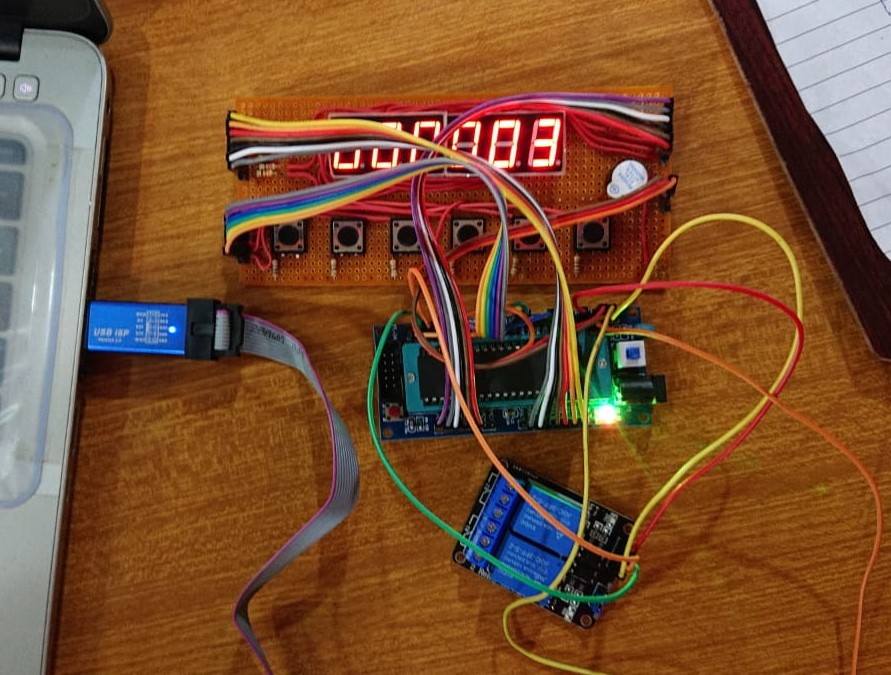

Project : Digital Clock with Alarm and two Actuating Relays

Project Description :
A digital clock or watch in which the hours, minutes, and sometimes seconds are indicated by digits, as opposed to an analog clock, where the time is indicated by the positions of rotating hands.
The clock has an alarm feature too.
It also includes an additional feature to drive two relays with different on and off time.

The clock is based on an avr based microcontroller Atmega16. The firmware is designed without using a high level library and the code is written from scratch by using register level programming. The time is displayed on six digit seven segment display with the help of multiplexing.
This project includes concept of interrupts timers and multiplexing.

Features :
1. Time Display
2. Clock Time Set
3. Alarm Time Set
4. Relay On/Off Time Set

How To Use :
Prerequisites:
    1. Proteus
    2. Atmel Studio (If you want to edit the code ) (Optional)
        For Example : If u want to run this code on a common cathode seven segment then u have to uncomment two lines and comment two lines in code to make it work for common cathode 7Segment display and build the project.
    3. AvrDude(For Hardware)
    4. UsbAsp (For Hardware)

1. Open Proteus and click run to start the simulation
2. It has six buttons to configure the clock for desired output
        a. Time Set --> It is used to enter in the time set mode
        b. Alarm Set --> It is used to enter in alarm time set mode
        c. Relay Set --> It is used to enter in Relay time set mode
                A0 - On time of Relay1
                A1 - Off time of Relay1
                A2 - On time of Relay2
                A3 - Off time of Relay2
        d. Return From Time/Alarm/Relay Set --> It is used to return from all the time set modes
        e. Increase --> It is used to increase the digit.
        f. Position --> It is used to select which digit u want to increment

Burn the firmware to hardware :
1. Open the atmel project file and build the project (By pressing F7 key). The hex file will be generated in the Debug folder.
2. Connect the usbasp pins to the respective pins of Atmega16.
3. Open AvrDude .
4. Select the programmer as usbasp.
5. Select the Bitclock to 32KHz
6. Detect the MCU.
7. Select the hexfile from flash section
8. Hit Program button

Hardware : 

Thank You.
